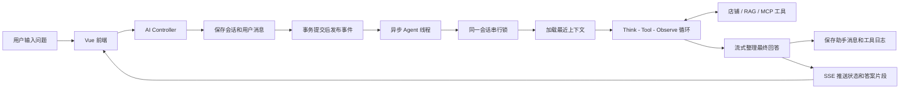
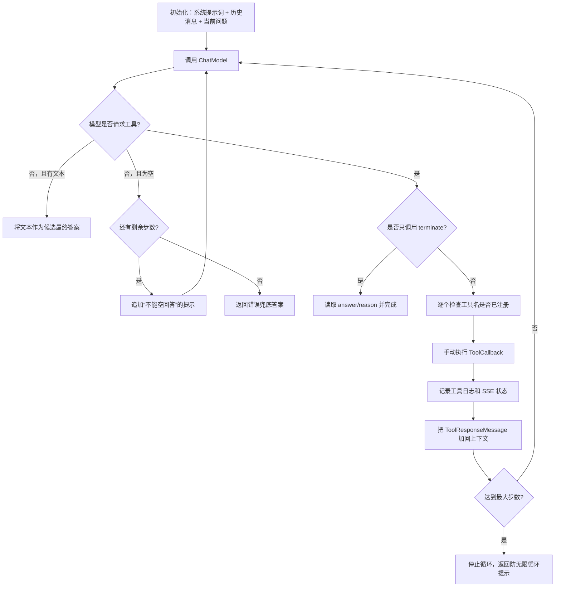
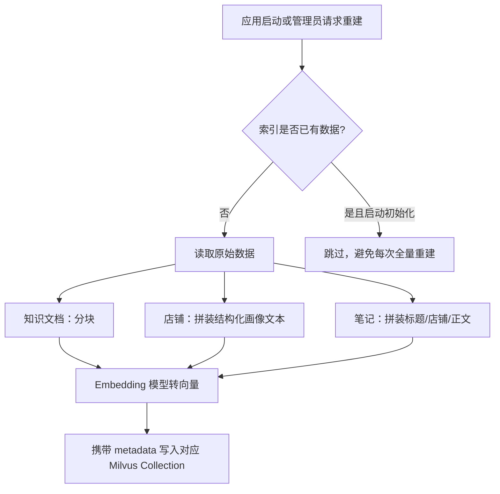

# 基于 Spring Boot 与 Spring AI 的同城生活服务平台 — Agent 模块流程拆解与面试指南

> 适用对象：第一次接触大模型、RAG、MCP、Agent 的同学。
>
> 本文以当前仓库代码为唯一事实来源，描述的是**已经实现的 Agent 链路**。文中会特别标明“当前事实”和“可优化点”，避免在面试时把设计设想说成已上线能力。

## 1. 先用一句话理解项目

这是一个本地生活（店铺、点评、优惠券）系统。它在传统业务系统之上加了一个 AI 助手：用户提问后，AI 可以按需查询店铺、点评、平台规则、向量知识库，必要时调用路线/天气能力，再组织为自然语言答案并流式返回页面。

它不是“把问题直接发给大模型”的普通聊天功能，而是一条完整的任务链路：



## 2. 零基础概念表

| 名词 | 通俗解释 | 在本项目中的对应物 |
| --- | --- | --- |
| LLM / 大模型 | 很会理解和生成文字的模型，但不天然知道本系统的实时数据 | `ChatModel`、`StreamingChatModel` |
| Prompt | 给模型的任务说明书 | `AgentLoopPromptProvider` |
| Tool Calling | 模型不直接猜数据，而是提出“请调用某个函数”的请求 | `@Tool` 方法、`ToolCallback` |
| Agent | 能判断是否查资料、选什么工具、根据结果继续决策的 LLM 程序 | `ManualToolAgentLoopExecutor` |
| ReAct / Agent Loop | “思考 -> 行动（调工具）-> 观察结果 -> 再思考”的循环 | 手动执行的 Think-Execute-Respond 循环 |
| RAG | 先检索业务资料，再让模型依据资料回答，减少幻觉 | Milvus 三类向量库和 `AiRagRetriever` |
| Embedding / 向量 | 将文本转为数字坐标，用语义相似度搜索 | OpenAI 兼容 Embedding + Milvus |
| MCP | 用统一协议连接外部工具/服务的方式 | 路线、天气的轻量 MCP Client |
| SSE | 服务端持续向浏览器推送单向事件的 HTTP 连接 | `SseEmitter` 和前端 `fetch` 流解析 |
| 幻觉 | 模型编造没有依据的事实 | 用工具、RAG、提示词、最大步数降低风险，但当前并非完全杜绝 |

## 3. 总体职责边界

### 3.1 按层看模块

| 层 | 主要类/文件 | 职责 | 不负责什么 |
| --- | --- | --- | --- |
| 接入层 | `AiAgentController` | 校验/限流、暴露会话、消息、推荐、分析、索引接口 | 不直接执行大模型任务 |
| 会话与记忆层 | `DbConversationMemoryService` | 会话归属、消息入库、加载短期历史 | 不做长期用户画像 |
| 任务调度层 | `ChatMessageCreatedEventListener` | 提交后异步消费聊天事件、串行调度、SSE 编排 | 不决定工具选择 |
| Agent 编排层 | `ManualToolAgentLoopExecutor` | 驱动模型调用、工具调用、终止、报错和最大步数 | 不实现业务查询细节 |
| 工具层 | `DianPingAgentTools`、`McpLocalLifeTools` | 将业务查询、RAG、外部能力暴露给模型 | 不保存对话 |
| 知识层 | `AiVectorIndexServiceImpl`、`AiRagRetriever` | 建索引、向量检索、知识库关键词兜底 | 不生成最终自然语言 |
| 输出层 | `ChatSseServiceImpl`、前端 `ai.js` | 推送/消费状态和文本片段 | 不替代数据库持久化 |

### 3.2 一个需要在面试中说清的事实

配置和枚举把场景命名为 `MULTI_AGENT`，但当前实际实现是：**一个通用 Agent Loop 加上一组工具**，不是多个拥有独立角色、彼此协作的 Agent（例如“规划 Agent + 检索 Agent + 审核 Agent”）。

因此建议表述为：“项目实现了多工具、多轮的 Agent，而不是严格意义上的多智能体协作。”这比泛称“多 Agent 系统”更准确。

## 4. 核心功能一：多轮聊天 Agent

### 4.1 用户从输入到收到答案的详细时序

以用户输入“周末三个人想吃火锅，推荐一下”为例：

1. 前端先确保已登录，并确保存在当前会话；没有则调用 `POST /ai/agent/conversations` 创建。
2. 前端**先建立 SSE 连接**：`GET /ai/agent/conversations/{id}/stream`，这样后端后续状态不会错过。
3. 前端调用 `POST /ai/agent/chat`。该接口最终转为 `CreateChatMessageRequest`，包含会话 ID、问题、可选经纬度。
4. `AiAgentServiceImpl.createChatMessage` 检查问题非空，并校验该会话属于当前用户；如果没有会话或会话失效则创建新会话。
5. 用户问题以 `role=user` 写入 `tb_ai_message`；同时更新会话标题和更新时间。
6. 在同一个事务内发布 `ChatMessageCreatedEvent`。注意：事件真正处理的时机是**事务成功提交之后**，防止异步线程读到尚未提交的消息。
7. `ChatMessageCreatedEventListener` 使用 `aiAgentTaskExecutor` 异步处理事件，所以 HTTP 请求可以很快返回 `conversationId` 和 `chatMessageId`，不必等待模型完成。
8. `ConversationExecutionCoordinator` 以 `conversationId` 获取 `ReentrantLock`。同一会话的两条问题必须按顺序执行，避免后一问先得到回答导致上下文错乱。
9. 记忆服务加载当前用户消息之前最近 `windowSize * 2` 条 user/assistant 消息，默认相当于最近 8 轮的窗口；工具消息不会重新塞进模型上下文。
10. Agent Loop 先放入系统提示词、历史消息、当前问题，开始“模型思考 -> 调工具 -> 将工具结果送回模型”的循环。
11. 得到候选答案后，后端会再用 `StreamingChatModel` 做一次流式润色；模型输出的每个增量文本都会作为 `answer_delta` 事件推给浏览器。
12. 最终答案以 `role=assistant` 写入数据库，后端依次发送 `message`、`answer_done`、`done` 事件。

### 4.2 为什么要“先存消息，再异步执行”

这是一个典型的“同步受理、异步耗时处理”设计：

```text
同步请求：鉴权 -> 保存用户问题 -> 返回消息已受理
异步任务：加载上下文 -> 调模型/工具 -> 保存答案 -> 推送结果
```

好处：

- 大模型和外部服务慢时，不会长时间占用 Web 请求线程。
- 用户刷新页面后，问题和最终回答仍在数据库里。
- SSE 可以持续展示“排队、思考、调工具、输出中”等状态。

当前边界：异步事件和会话锁都在单个 JVM 内存中；应用崩溃后没有任务表/消息队列用于恢复，也不能跨多实例保证同一会话串行。这是目前的可优化点，不应说成已实现分布式可靠任务调度。

## 5. 核心功能二：手动 ReAct 工具循环

### 5.1 为什么叫“手动”循环

Spring AI 可以让框架自动处理工具调用，但项目把 `internalToolExecutionEnabled` 设为 `false`，自己读取模型返回的 Tool Call，自己执行工具，再把工具结果放回消息列表。这就是“手动驱动”。

这样做的价值是：项目可以完全掌握步骤数、工具日志、SSE 进度、异常文案和终止条件，方便面试时解释可观测性与可控性。

### 5.2 单轮循环流程



### 5.3 关键保护机制

| 机制 | 实现方式 | 要解决的问题 |
| --- | --- | --- |
| 最大步数 | `ai.agent.multi-agent.max-steps`，默认 20 | 防止模型反复调用工具造成无限循环、成本失控 |
| 非并行工具 | `parallelToolCalls(false)` | 让工具结果按确定顺序进入下一轮，降低复杂度 |
| 未注册工具拒绝 | 注册表查不到即结束 | 模型不能调用任意 Java 方法 |
| 空响应重试 | 追加明确二选一提示 | 避免模型既不回答也不调工具 |
| `terminate` 工具 | 模型信息足够时明确结束 | 防止“已经会答仍继续想”的空转 |
| 工具异常兜底 | 捕获异常，返回友好错误回答 | 不让异常直接打断 HTTP/SSE 链路 |
| 简单推荐收束 | 命中偏好关键词后，首轮工具结果后追加收束提示 | 降低简单场景多轮空转 |

### 5.4 `terminate` 为什么设计成工具

普通文本回答也会结束循环，但 `terminate(answer, reason)` 是一个显式的“任务完成协议”。它让代码能识别：这是模型主动结束、答案是什么、结束原因是什么。前端和日志中还能看到 `terminatedByTool`。

面试回答：它不是为了增加复杂度，而是让 Agent 的结束点从“猜模型有没有答完”变成“可解析、可审计的结构化信号”。

## 6. 核心功能三：工具体系

### 6.1 工具如何注册、如何被调用

`AgentLoopToolRegistry` 将三个工具类的 `@Tool` 方法转成 Spring AI 的 `ToolCallback`：

1. 启动时把本地业务工具、控制工具、MCP 工具转换为工具定义。
2. 模型在 `ChatModel.call` 中能看到工具名称、说明和参数 schema。
3. 模型返回如 `getShopDetail({"shopId": 1})` 的请求。
4. 手动循环按名称从 Map 中取回 `ToolCallback`。
5. 工具返回的数据被序列化为 Tool Response，再传给模型继续推理。

这是一种“模型负责决策，代码负责执行”的分工。模型没有数据库账号，也不能直接执行 SQL；它只能在白名单工具中选。

### 6.2 已实现工具清单

| 工具类别 | 代表工具 | 数据来源 | 典型用途 |
| --- | --- | --- | --- |
| 店铺基础查询 | `getShopDetail`、`searchNearbyShops`、`searchShopsByKeyword` | MySQL/既有店铺服务 | 查门店、附近门店、商圈和地址 |
| 点评文本 | `getShopReviewTexts`、`getShopReviewSummary` | Blog 表 | 看热门探店笔记、样本量提示 |
| 平台规则 RAG | `searchKnowledgeBase` | Milvus + 本地知识文档兜底 | 会员、优惠券、秒杀、退款等规则问答 |
| 店铺语义检索 | `vectorSearchShopProfiles` | 店铺画像向量集合 | “想吃辣、预算 100”的语义化推荐 |
| 点评语义检索 | `vectorSearchBlogs`、`vectorSearchBlogsByShop` | 探店笔记向量集合 | 评价总结、指定店铺评价检索 |
| 路线/天气 | `getRouteAdvice`、`getWeatherDiningAdvice` | 外部 MCP 或本地降级 | 到店路线、天气下的就餐建议 |
| 控制工具 | `terminate` | 无外部数据 | 声明任务完成 |

### 6.3 工具选择示例

用户问“店铺 ID 3 的服务怎么样？”时，合理链路通常是：

```text
getShopDetail(3) -> getShopReviewSummary(3) 或 vectorSearchBlogsByShop(3, "服务", topK)
-> 模型根据真实样本总结 -> terminate
```

用户问“会员有什么福利？”时，合理链路通常是：

```text
searchKnowledgeBase("会员有什么福利") -> 依据命中的规则片段回答 -> terminate
```

用户问“怎么去某店，今天天气适合吗？”时，模型可先取店铺详情，再按需调用路线和天气工具。

### 6.4 工具层当前限制与改进方向

当前实现有“工具白名单”和“最大总步数”，但还没有为每个工具统一配置独立的权限、调用次数、超时、重试、缓存与参数范围校验。尤其 `searchNearbyShops` 的页码、RAG 的 `topK` 等仍主要依赖模型正常传参。

面试中可以说下一步会引入 `ToolExecutionGateway`：在真实工具之前统一做场景授权、schema 校验、配额、超时、熔断和结构化降级。这是**优化设计**，不是当前代码已有模块。

## 7. 核心功能四：会话、短期记忆与数据持久化

### 7.1 两张核心表

| 表 | 关键字段 | 含义 |
| --- | --- | --- |
| `tb_ai_conversation` | `user_id`、`title`、`scene`、`status`、时间字段 | 一条会话的归属和列表展示信息 |
| `tb_ai_message` | `conversation_id`、`role`、`content`、`tool_name`、`tool_payload` | 一条用户、助手或工具消息 |

`role` 有三种值：`user`、`assistant`、`tool`。工具结果也会保存，但重建模型上下文时仅加载 user/assistant，避免把长工具输出无限累积进 Prompt。

### 7.2 记忆窗口如何工作

默认 `window-size=8`。代码查询最近 `windowSize * 2` 条用户/助手消息，按时间正序转为 Spring AI 的 `UserMessage` 与 `AssistantMessage`。

为什么不无限带历史？因为：

- 上下文越长，模型调用越慢、Token 越贵。
- 早期对话中的无关信息会干扰本轮判断。
- 模型有上下文长度上限。

当前实现是**短期会话记忆**，不是长期记忆：它不会自动提取“用户忌口、预算、常去区域”并跨会话保存。面试回答时要明确区分这两个概念。

## 8. 核心功能五：RAG 与三类向量索引

### 8.1 为什么不把所有资料放进一个向量库

项目按语义和用途拆成三个 Milvus Collection：

| Collection | 内容 | 建索引时的文本形态 | 查询场景 |
| --- | --- | --- | --- |
| `knowledge_vector` | 平台规则文档 | `knowledge/*.txt` 切块 | 规则、会员、优惠券、退款 |
| `shop_profile_vector` | 店铺结构化画像 | 店名、商圈、均价、评分、营业时间等拼成描述 | 模糊条件下推荐店铺 |
| `blog_review_vector` | 探店笔记/评论 | 标题 + 店名 + 正文 | 分析口碑、菜品、服务、环境 |

这样做比混在一起更好：规则问题不会被点评淹没，店铺推荐不会错误召回平台规则；每一类还能设置自己的元数据过滤条件，例如按 `shopId` 限制评论检索范围。

### 8.2 建索引流程



启动时 `KnowledgeBaseInitializer` 调用 `ensureInitialized`，采用“缺什么补什么”策略。默认 `fail-fast=false`：Milvus 或 Embedding 不可用时记录警告但不阻断整个 Spring Boot 服务启动。

### 8.3 平台知识检索的双路兜底

`searchKnowledge` 不只查向量库：

1. 先进行向量相似度检索；平台知识阈值默认较低（0.35），以提高规则问答的召回率。
2. 从用户问题中抽取轻量中文关键词和业务关键词，如“会员”“秒杀”“退款”。
3. 扫描 `classpath:knowledge/*.txt` 的段落，按关键词命中数得到候选片段。
4. 合并、去重并按关键词覆盖度和向量分数排序，取 `topK`。

好处：当向量模型对业务专有名词召回较弱时，仍可能找到“明明写在规则文档里”的内容。

当前代价：关键词兜底会在请求路径读取 classpath 文档，数据大时会影响性能；这是可通过启动预加载/缓存改进的点。

### 8.4 RAG 的面试表述

不要只说“接了 Milvus”。更完整的回答是：

“我们将知识、店铺、点评拆为三类 Collection，索引时保留业务 metadata；查询时 Agent 依据问题选择检索工具。平台规则额外做了向量召回加关键词 fallback，并进行合并去重，目标是在专业规则问答中提升召回稳定性。”

## 9. 核心功能六：MCP 外部能力与本地降级

### 9.1 路线和天气流程

`McpLocalLifeTools` 把路线、天气暴露为 Agent 工具，实际调用由 `LocalLifeMcpService` 处理：

```text
模型请求路线/天气
  -> 检查总开关、服务开关、Base URL、工具白名单
  -> 组装 { tool, arguments } 请求
  -> 2.5 秒（默认）超时内调用远程 MCP 服务
  -> 成功：映射远程 JSON 为 DTO
  -> 失败/未配置/不在白名单：返回本地降级 DTO
```

路线降级用 Haversine 公式根据经纬度估算直线距离，再给步行/骑行/地铁/打车建议；天气降级依据当前月份和用餐场景给季节性建议。返回 DTO 中会标记 `source=local-fallback`、`degraded=true`，因此调用方有机会向用户如实说明精度有限。

### 9.2 为什么 MCP 要有白名单和降级

- 白名单防止模型借由参数调用不应开放的远程工具。
- 超时防止外部服务慢拖垮整个聊天任务。
- 降级保证地图/天气不可用时，核心推荐/问答仍能完成。

当前默认 `AI_AGENT_MCP_ENABLED=false`，因此本地开发环境通常走降级逻辑。不要声称项目默认接入了真实实时地图/天气数据。

## 10. 核心功能七：SSE 流式体验与前端容错

### 10.1 后端事件类型

| SSE 事件 | 含义 | 前端动作 |
| --- | --- | --- |
| `connected` | SSE 通道连接成功 | 确认连接 |
| `status` | 排队、思考、执行工具、正在整理等状态 | 更新“正在思考”提示 |
| `message` | 已持久化的 user/assistant/tool 消息 | 必要时补充会话消息 |
| `answer_delta` | 最终回答的增量文本 | 逐字/逐片段追加显示 |
| `answer_done` | 最终文本与助手消息 ID | 固化最终气泡 |
| `error` | 异步过程出现异常 | 展示错误信息 |
| `done` | 当前任务收尾 | 结束本轮等待 |

### 10.2 为什么前端不用原生 EventSource

原生 `EventSource` 不方便自定义 `Authorization` 请求头。该项目改用 `fetch` 发起 SSE GET 请求，手工读取 `ReadableStream`，按空行切块并解析 `event:` 与 `data:`。这样既能保持 SSE 流式效果，也能携带登录 token。

### 10.3 两层输出兜底

Agent Loop 先产生候选答案；随后尝试调用流式模型把候选答案和工具摘要整理成更适合前端阅读的文本。

- 流式模型不可用或被关闭：将候选答案按固定大小切片，伪流式推送。
- 流式模型中途失败：已有部分会保留，再用候选答案补全；没有任何片段时直接发送候选答案。

体验上保持“逐步出现”；可靠性上不会因为第二阶段的流失败而丢掉第一阶段的 Agent 结论。

需要诚实指出的权衡：两阶段生成会多一次模型调用和 Token 成本，也存在第二个模型改写/弱化工具事实的风险。当前系统仅通过提示词约束“不要编造”，没有强制的引用校验机制。

## 11. 核心功能八：专用接口与通用聊天的关系

| 接口 | 处理方式 | 是否写入会话/SSE | 返回特点 |
| --- | --- | --- | --- |
| `POST /ai/agent/chat` | 完整异步聊天链路 | 是 | 前端通过 SSE 获得最终答案 |
| `POST /ai/agent/messages` | 与 chat 同一底层逻辑 | 是 | 返回消息受理结果 |
| `POST /ai/agent/recommend` | 同步直接执行通用 Agent Loop | 否 | 只返回 `summary`，当前未结构化填充推荐 `items` |
| `GET /ai/agent/analyze/shop/{shopId}` | 同步直接执行通用 Agent Loop | 否 | `sampleSize` 固定为 0，并明确提示未走固定分析链路 |
| 索引重建接口 | 直接调用向量索引服务 | 否 | 返回重建数量 |

这张表是面试高频细节：虽然有“推荐”和“店铺分析”接口，但它们当前也复用了通用 Agent Loop，不是确定性的专用工作流。专用接口适合未来演进成“检索 -> 筛选/排序 -> 结构化返回”或“店铺详情 -> 评论样本 -> 事实摘要”的固定流程。

## 12. 并发、安全、限流与可靠性

### 12.1 已实现措施

| 风险 | 当前做法 | 效果 |
| --- | --- | --- |
| 未登录访问会话 | 从 `UserHolder` 读取用户，查询会话时校验 owner | 防止跨用户查看会话 |
| 同会话并发提问 | JVM 内 `ReentrantLock` 串行化 | 防止上下文/回答顺序错乱 |
| 高频刷 AI 接口 | `@SlidingWindowLimit` + Redis Lua 滑动窗口限流 | 保护模型成本和服务容量 |
| 无限工具调用 | 最大 20 步 | 限制循环与费用 |
| 非法工具调用 | 只执行注册表中的工具 | 避免模型任意执行代码 |
| 外部 MCP 波动 | 超时、白名单、本地 fallback | 使单点外部能力失效不影响主流程 |
| 向量服务异常 | 启动初始化默认不 fail-fast | 不让 AI 基础设施故障阻断整站启动 |

### 12.2 还未解决的生产级问题

1. 会话锁、SSE emitter、异步事件都在单机内存；多实例部署需要 Redis 分布式锁、消息队列或持久化任务调度。
2. 没有请求幂等键；网络重试可能重复插入用户问题。
3. 工具日志做了长度截断，但缺少完整 traceId、耗时、Token、工具成功率等统一观测指标。
4. 索引重建接口看起来是管理能力，当前没有看到额外的角色权限控制，应在生产中补上。
5. 工具结果尚未形成带证据 ID 的 `Evidence Pack`，最终答案不能强校验引用是否来自本轮真实数据。

## 13. 典型面试问题与参考回答

### Q1：这个 Agent 和普通 ChatGPT 接口有什么差别？

普通接口通常是“问题 + Prompt -> 模型文本”。本项目在模型之外增加了会话持久化、短期记忆、工具调用循环、RAG、外部服务降级、异步执行、会话串行化和 SSE。模型负责决策和表达，代码负责数据访问、权限、状态和可靠性。

### Q2：为什么不用模型直接回答店铺和优惠券问题？

模型的训练知识可能过期，也不知道本项目数据库中的实时店铺/点评数据。店铺详情走业务服务，规则走 RAG，模型只基于取回的事实组织答案，可以显著降低编造概率。

### Q3：ReAct 循环如何避免无限循环？

代码级默认最大 20 步；每轮若无工具且有文本则结束；若调用 `terminate` 且携带答案则立即结束；模型空响应只在剩余步数内重试；未知工具和工具异常直接走兜底结束。提示词还要求信息足够就 terminate。

### Q4：为什么工具调用不交给框架自动执行？

手动执行可在每一步记录状态、保存工具结果、实时通过 SSE 展示，并统一处理未注册工具、异常和最大步数。代价是编排代码更多；对于更复杂项目可以抽象工具网关降低维护成本。

### Q5：RAG 的完整流程是什么？

先把知识文档、店铺画像、点评笔记处理成文本并做 Embedding，连同 metadata 写入不同 Milvus Collection。查询时按场景调用对应检索工具，向量库返回相似片段，模型把片段用于回答。平台规则还加了关键词兜底、合并、去重和排序。

### Q6：聊天为什么要异步和 SSE？

模型/工具耗时不可预测。先持久化并返回“已受理”能避免同步请求超时；异步任务在后台执行，SSE 立即反馈排队与思考状态，并把最终回答增量展示，兼顾接口吞吐和体验。

### Q7：同一用户连续发送两句话如何保证上下文不乱？

按 `conversationId` 串行加锁。前一条在执行期间，后一条等待；前一条完成后，后一条加载到的历史中就能包含刚保存的助手回答。当前是单 JVM 锁，分布式部署需换成分布式锁/任务队列。

### Q8：路线/天气服务挂了怎么办？

先检查配置和白名单，再带超时调用 MCP；任何失败都返回本地兜底建议，并在 DTO 用 `degraded` 标识。这样 Agent 可继续完成回答，而不是因为一个外部服务失败而整体失败。

### Q9：当前最大技术债是什么？

我会优先处理三项：第一，按场景改为确定性工作流，避免所有任务进入一个通用 Loop；第二，引入持久化任务/outbox 和分布式会话锁；第三，把工具结果结构化成证据包，并校验最终回答引用，进一步控制幻觉和两阶段改写风险。

### Q10：项目里的支付与超时关单如何避免并发冲突？

这是传统订单链路已经完成的改进：创建支付、支付回调和超时关单都竞争 `lock:order:订单ID`，使用现有 Redisson `RLock` 最多等待 2 秒，并通过不指定租期启用 watchdog 自动续期。拿到锁后重新读取订单，在 `TransactionTemplate` 的独立事务中通过 `id + 未支付状态` 条件更新，事务提交或回滚后才解锁。支付先完成，后续关单不恢复库存；关单先完成，后续支付被拒绝。

订单取消和 MySQL 库存恢复在同一事务中完成。数据库提交后，Redis 库存和用户秒杀资格通过内嵌 Lua 补偿，使用 `seckill:rollback:订单ID` 去重；补偿失败或关单抢锁失败会抛异常，让 RocketMQ 重试。重复消息不重复增加数据库库存，已取消订单仍可继续补偿 Redis。创建支付只更新支付方式，控制器会返回真实失败结果。

面试时要区分两个锁的范围：**订单状态操作已使用跨实例订单锁，AI 会话串行仍是单 JVM 的 `ReentrantLock`**。本次新增 9 个回归场景已通过，采用模拟存储和内存共享锁，尚未完成真实中间件联调；也不能把提交后 Redis 补偿说成 MySQL 与 Redis 的原子事务。完整说明见 [项目文档 4.5](PROJECT_DOCUMENTATION.md#45-模拟支付与超时关单)。

## 14. 面试时可按这个结构讲项目

建议 2 分钟版本：

> 我做的是本地生活 AI 助手。用户消息先落 MySQL，再在事务提交后异步触发 Agent，避免大模型耗时阻塞接口。同一会话使用锁串行，加载最近对话作为短期记忆。核心是手写的 ReAct Loop：模型决定是否调用店铺、点评、RAG、路线天气等白名单工具，代码负责执行、记录日志、限制最大 20 步并通过 SSE 推送过程。知识侧把平台规则、店铺画像、探店笔记分到三个 Milvus 向量集合，规则查询还做关键词 fallback。最终答案采用 SSE 流式输出，流式模型失败会回退到 Agent 候选答案。当前我也明确它是单通用 Agent，而非严格多智能体；下一步会做场景工作流、任务持久化和证据引用校验。

## 15. 源码阅读顺序

建议按下面顺序打开，能最快建立全局认识：

1. `src/main/java/com/hmdp/ai/controller/AiAgentController.java`：从接口了解能力边界。
2. `src/main/java/com/hmdp/ai/service/impl/AiAgentServiceImpl.java`：看消息如何入库、事件如何发出。
3. `src/main/java/com/hmdp/component/ChatMessageCreatedEventListener.java`：看异步、SSE、两阶段生成总编排。
4. `src/main/java/com/hmdp/ai/agent/loop/ManualToolAgentLoopExecutor.java`：看 Agent 的核心循环。
5. `src/main/java/com/hmdp/ai/tool/DianPingAgentTools.java`：看模型实际可用的业务能力。
6. `src/main/java/com/hmdp/ai/rag/indexer/AiVectorIndexServiceImpl.java` 和 `src/main/java/com/hmdp/ai/rag/retriever/AiRagRetriever.java`：看数据如何进入/离开向量库。
7. `src/main/java/com/hmdp/ai/mcp/LocalLifeMcpService.java`：看外部工具治理和降级。
8. `frontend-vue/src/store/ai.js`：看前端如何先连 SSE、后发消息，并在流失败时轮询。

## 16. 本文与当前代码的关键对应关系

| 文中能力 | 核心实现 |
| --- | --- |
| 会话消息持久化 | `DbConversationMemoryService`、`tb_ai_conversation`、`tb_ai_message` |
| 提交后异步执行 | `ChatMessageCreatedEvent` + `@TransactionalEventListener(AFTER_COMMIT)` + `@Async` |
| 同会话串行 | `ConversationExecutionCoordinator` |
| 手动 Agent Loop | `ManualToolAgentLoopExecutor` |
| 工具白名单 | `AgentLoopToolRegistry` |
| 三类向量索引 | `AiVectorIndexServiceImpl`、三个 `VectorStore` Bean |
| RAG 召回 | `AiRagRetriever` |
| MCP/降级 | `LocalLifeMcpService` |
| 流式事件 | `ChatSseServiceImpl`、`ChatMessageCreatedEventListener` |
| 前端 SSE 解析与轮询退化 | `frontend-vue/src/api/modules/ai.js`、`frontend-vue/src/store/ai.js` |

