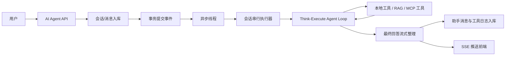
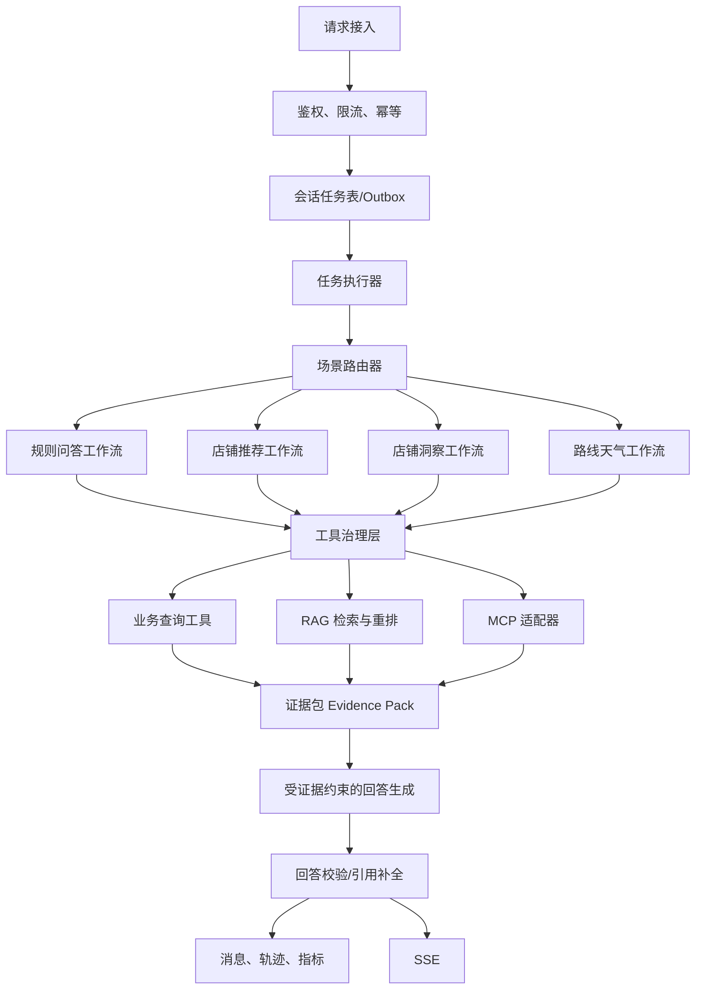

# 基于 Spring Boot 与 Spring AI 的同城生活服务平台 — Agent 优化设计说明

## 1. 文档目的与范围

本文基于当前 “基于 Spring Boot 与 Spring AI 的同城生活服务平台” 的 Agent 实现，给出面向下一阶段演进的优化设计。目标是在保留现有 Spring AI、Milvus、MySQL、Redis 和 SSE 技术栈的前提下，提高本地生活问答、店铺推荐、店铺分析、路线/天气建议等场景的稳定性、可控性、可观测性与成本效率。

本文聚焦 Agent 系统，不调整既有的优惠券、秒杀、支付和社交业务链路。

订单业务现已完成支付与超时关单的并发改进：共用按订单 ID 的 Redisson 锁、自动续期、事务提交后解锁、未支付状态条件更新，以及可重试的库存幂等补偿，详见 [项目文档 4.5](PROJECT_DOCUMENTATION.md#45-模拟支付与超时关单)。这是已有业务实现；本文后续提出的 Agent 分布式会话锁、任务持久化和 Outbox 仍属于优化设计，当前 AI 会话串行仍在单 JVM 内执行。

## 2. 当前实现概览

当前实现已经具备一个完整的单 Agent 执行闭环：



已具备的基础能力：

- 使用 `ManualToolAgentLoopExecutor` 手动驱动模型思考、工具调用、终止和最大步数保护。
- 内置店铺检索、店铺详情、评论、知识库和向量检索工具；路线、天气可通过 MCP 调用并有本地降级。
- 以 MySQL 保存会话、用户消息、助手消息和工具摘要；按最近轮次加载历史上下文。
- 使用 Milvus 存储知识库、店铺画像、探店笔记三类向量数据，并提供关键词兜底召回。
- 利用事务后异步执行与 SSE，将“消息已受理”和 Agent 处理过程解耦。
- 当前按会话使用 JVM 内 `ReentrantLock` 串行化，避免同一会话的上下文乱序。

## 3. 关键问题与优化机会

### 3.1 场景路由名义存在，实际仍是一个通用 Agent

`AiAgentScene` 虽定义了场景，但 `AgentLoopExecutor` 当前固定标记为 `MULTI_AGENT`，所有在线对话都进入同一套提示词、同一份工具全集和同一循环策略。推荐、店铺分析、规则问答、路线天气等任务的目标和所需工具不同，通用循环会导致工具选择不稳定、步骤冗余和提示词膨胀。

### 3.2 工具缺乏统一治理边界

工具注册表能够发现工具，但当前没有按场景、用户身份、风险等级、调用预算、超时和重试策略进行集中约束。模型若重复或组合调用代价高的工具，只依赖提示词限制；本地工具失败会使整个 Loop 直接失败，无法返回“部分可用”的答案。

### 3.3 执行可靠性依赖单机进程

事务提交事件结合 `@Async` 可以提升响应体验，但任务只存在于当前 JVM 的内存调度中。服务重启、线程池拒绝或多实例部署时，缺少可恢复任务记录、跨实例会话锁和幂等消费保障。现有 `ConversationExecutionCoordinator` 也只在单 JVM 生效。

### 3.4 记忆只截取窗口，缺少长期语义记忆

当前通过最近 `window-size * 2` 条用户/助手消息构建上下文。对跨多轮的饮食偏好、预算、忌口、常用地点等信息会逐渐遗失；会话中间的工具结论也没有被结构化沉淀。仅增大窗口会直接提高 Token 成本并放大噪声。

### 3.5 RAG 召回与证据使用仍可进一步分层

当前 RAG 已有向量 + 关键词 fallback，是很好的基础。但知识文本 fallback 每次查询都会扫描 classpath 文件；多源结果没有统一的重排、去重、时效和可信度策略；模型最终回答也没有强制输出其使用的数据来源或证据标识。

### 3.6 回答生成存在两阶段成本与一致性风险

Agent Loop 已经得到候选回答或 `terminate` 的最终回答后，系统再调用流式模型做最终整理。该设计改善了流式体验，但会多一次模型调用，并可能让第二次模型改写、遗漏甚至弱化前一阶段的真实工具结论。需要将“回答草稿”和“证据约束”显式化。

### 3.7 可观测性和评测体系不足

现有工具日志与 SSE 状态可用于排查，但还不能稳定回答：某场景成功率多少、哪个工具最常失败、平均调用多少步、单次成本多少、RAG 是否命中、是否发生事实越界。缺少离线基准集和线上质量反馈闭环。

## 4. 优化目标与原则

### 4.1 目标

1. 让简单问答尽量一次模型调用完成，让复杂任务按场景执行最少必要步骤。
2. 让工具调用可授权、可限额、可超时、可降级、可审计。
3. 让会话任务可恢复、可幂等，并支持未来多实例部署。
4. 让回答可追溯到店铺、评论、知识文档、路线或天气等事实证据。
5. 在质量不降级的前提下，降低平均 Token、工具调用和模型调用次数。

### 4.2 原则

- 先确定性、后生成性：能由业务规则、检索和排序直接完成的步骤，不交给模型自由推理。
- 先路由、后编排：先识别任务类型，再提供最小化工具集合和对应工作流。
- 先证据、后表达：最终回答只能使用已收集并通过校验的证据。
- 失败可降级：一个外部工具失败不应直接毁掉整次回答。
- 每一次调用都可解释：记录决策、工具参数摘要、耗时、结果状态和证据来源。

## 5. 目标架构



### 5.1 场景路由器

新增 `AgentSceneRouter`，返回 `SceneDecision`：`scene`、`confidence`、`requiredSlots`、`allowedTools`、`executionMode`。

建议第一阶段采用“规则优先 + 轻量模型兜底”的混合路由：

| 场景 | 识别特征 | 推荐执行方式 | 默认工具 |
| --- | --- | --- | --- |
| 平台规则问答 | 会员、优惠券、退款、秒杀等 | RAG 问答工作流 | `searchKnowledgeBase` |
| 店铺推荐 | 预算、口味、人数、附近、推荐 | 检索-筛选-排序 | 向量店铺检索、关键词/附近检索 |
| 店铺洞察 | 店铺 ID、这家店、评价如何 | 固定分析流水线 | 店铺详情、评论摘要、店铺评论向量 |
| 路线/天气 | 怎么去、距离、下雨、温度 | 外部服务优先、降级 | 路线或天气 MCP |
| 普通闲聊 | 无业务事实要求 | 直接回答 | 无工具 |

路由不应把一个确定性的店铺分析任务交给通用循环自由决定。对于必需参数缺失的场景，优先生成澄清问题，而不是盲目搜索。

### 5.2 工作流编排器

引入 `AgentWorkflow` 接口及场景实现，例如 `RecommendationWorkflow`、`ShopInsightWorkflow`。每个工作流定义：输入槽位、工具白名单、最大步骤、成功条件、降级策略与答案模板。

保留通用 ReAct/Tool Loop，作为未知复杂问题的兜底，而不是所有请求的默认路径。工作流中可采用：

- 确定性步骤：店铺分析中的“详情 -> 评论摘要 -> 证据打包”。
- 受限模型决策：仅在多个候选、意图不明或需要自然语言规划时调用。
- 并行只读工具：当数据之间无依赖时，可有限并行，例如店铺详情与评论摘要；设置全局并发阈值。

### 5.3 工具治理层

在 `ToolCallback` 之外新增统一 `ToolExecutionGateway`。它接收结构化 `ToolCallRequest`，负责校验后调用真实工具，并返回统一 `ToolCallResult`。

每个工具应具有注册元数据：

```text
name, sceneAllowList, riskLevel, timeout, retryPolicy,
maxCallsPerTask, cachePolicy, requiresLogin, parameterSchema,
resultSchema, fallbackStrategy, evidenceType
```

核心策略：

- 按场景暴露工具，而不是把完整工具集交给所有模型请求。
- 按任务维护工具调用计数和“参数规范化后的去重键”，拒绝重复查询。
- 本地查询、RAG、MCP 分别设置独立超时；外部 MCP 使用熔断、短时重试和缓存降级。
- 工具失败返回结构化的 `UNAVAILABLE`、`INVALID_ARGUMENT`、`EMPTY_RESULT`，让工作流选择替代步骤，而不是立即终止整次任务。
- 严格校验参数范围，例如坐标、`topK`、店铺 ID、关键词长度；禁止模型传入不受控分页和过大返回量。

## 6. 数据、记忆与 RAG 设计

### 6.1 会话记忆分层

将会话上下文拆为三层，而不是仅保留最近消息：

| 层级 | 内容 | 建议存储 | 注入方式 |
| --- | --- | --- | --- |
| 短期上下文 | 最近完整对话与本轮工具结果 | `tb_ai_message` | 固定 Token/轮次窗口 |
| 会话摘要 | 已确认偏好、未完成计划、关键结论 | `tb_ai_conversation_memory` | 每轮按需注入 |
| 用户长期偏好 | 忌口、预算、偏好品类、常用商圈 | `tb_ai_user_profile` | 明示同意后按需注入 |

会话摘要应是结构化 JSON，例如 `budgetRange`、`partySize`、`tastePreferences`、`dislikes`、`city`、`pendingQuestion`、`updatedAt`。由模型抽取时必须使用 schema 校验；高风险或隐私字段不能自动写入长期偏好。

### 6.2 RAG 检索流水线

将现有 RAG 演进为统一 `RetrievalService`：

1. 查询改写：仅在问题依赖上文时，将会话摘要补入检索查询。
2. 多路召回：知识库、店铺画像、探店笔记按场景选择，不盲目全量检索。
3. 归一化：统一不同集合的分数、来源、发布时间和业务类型。
4. 重排：综合语义相关度、关键词覆盖、评论热度、数据时效、距离和店铺状态。
5. 去重与截断：同源内容合并，按 Token 预算生成证据片段。
6. 证据包：输出带 `evidenceId`、来源类型、来源主键、摘要和分数的结构化对象。

关键词 fallback 不建议在请求路径逐次读取 classpath 文件。应用启动时应完成分段缓存，或将同一份知识内容直接纳入统一索引；保留 fallback 仅作为索引不可用时的降级路径。

### 6.3 回答与证据绑定

最终生成输入应使用 `EvidencePack`，而不是仅拼接截断后的工具日志。回答输出建议采用结构化协议：

```json
{
  "answer": "自然语言回答",
  "recommendations": [{"shopId": 1, "reason": "...", "evidenceIds": ["shop:1", "blog:24"]}],
  "assumptions": ["用户未提供位置，未按距离排序"],
  "citations": ["shop:1", "blog:24"]
}
```

服务端需校验 `citations` 只能引用本轮 Evidence Pack 中的 ID。校验失败时删除无效引用、降级为模板式回答，或触发一次受限修复，而非无限重试。

## 7. 任务可靠性与并发设计

### 7.1 持久化任务与 Outbox

新增 `tb_ai_task` 与 `tb_ai_outbox`：用户消息和待执行事件在同一事务中写入。后台消费者扫描/消费 outbox 后执行任务，并以任务状态机管理生命周期：

```text
PENDING -> RUNNING -> SUCCEEDED
                 -> DEGRADED
                 -> FAILED
                 -> CANCELLED
```

任务表至少包含：`task_id`、`conversation_id`、`user_message_id`、`request_id`、`scene`、`status`、`attempt`、`lease_until`、`started_at`、`finished_at`、`error_code`、`trace_id`。

这样可以将“事务提交后异步事件”升级为“可恢复执行任务”。早期可用 MySQL 轮询实现，后续可切换 RocketMQ；任务接口与状态机不随消息中间件变化。

### 7.2 幂等与分布式会话顺序

- 创建消息接口增加 `requestId`/幂等键，并在 `(user_id, request_id)` 上建立唯一约束，避免客户端重试生成重复提问。
- 用 Redis 分布式租约或数据库条件更新领取会话任务；锁键为 `ai:conversation:{conversationId}`，租约应覆盖最大执行时间并支持续租。
- 任务消费以 `user_message_id` 为幂等键，已完成任务不重复执行。
- 任务完成时采用乐观状态更新，防止超时 worker 与重试 worker 同时写入最终结果。
- 前端 SSE 重连以 `lastEventId` 或消息 ID 补发，不能只依赖进程内 emitter。

### 7.3 取消、超时与资源预算

用户发起新消息或显式取消时，标记正在执行的任务为 `CANCEL_REQUESTED`。每个 Loop 步骤、模型调用与工具调用都检查取消标志。除了 `maxSteps`，增加以下预算：

- 总执行超时（例如 45 秒）。
- 模型调用次数和输入/输出 Token 上限。
- 单工具与全任务工具调用次数上限。
- 最大 Evidence Pack 大小和单工具响应大小。
- 单用户/单会话并发任务上限。

## 8. 模型调用与流式输出优化

建议将当前“Agent Loop 后再次模型流式整理”的行为改成可配置的两种模式：

1. `single_pass_stream`：简单问答直接使用流式模型，禁止工具或仅允许一次检索前置；最低时延和成本。
2. `evidence_then_render`：复杂任务先执行工具生成 Evidence Pack，再用一次流式渲染模型生成回答；渲染模型只读取证据，不能发起工具。

不建议在复杂任务中既让 Loop 生成完整答案，又让第二个模型自由改写。若保留候选答案，应把它降为“渲染参考”，并要求渲染结果通过证据引用校验。

SSE 事件建议统一为：`task_status`、`tool_started`、`tool_finished`、`answer_delta`、`answer_completed`、`task_failed`。事件携带 `taskId`、`traceId`、`sequence`，便于重连、排序和前端展示。

## 9. 安全、隐私与成本控制

- 提示词与工具返回内容均视为不可信输入；工具结果不得覆盖系统指令，防范间接提示词注入。
- MCP 凭证只保存在服务端配置中，日志与 SSE 中脱敏；外部工具按白名单域名和工具名调用。
- 用户地理位置、历史偏好与会话内容设置保留期限和删除能力；长期偏好默认关闭或要求用户授权。
- 为模型、向量检索、MCP 调用分别记录成本和配额；按用户、场景和任务设置限流，避免当前只按通用字符串或会话 ID 聚合导致相互影响。
- 对“下单、支付、修改账户”等未来写操作工具使用确认卡片和服务端二次校验，模型不得直接执行。

## 10. 可观测性、评测与质量闭环

### 10.1 Trace 模型

为一次请求创建 `traceId`，贯穿 API、任务、场景路由、模型、工具、RAG、SSE 和消息记录。每个 span 记录：状态、耗时、输入/输出长度、模型名、Token、工具名、错误码、降级原因和证据数量。

建议先通过结构化日志 + Micrometer 指标落地，再接入 OpenTelemetry/Prometheus/Grafana。

建议核心指标：

- 任务成功率、降级率、取消率、超时率、P50/P95 总耗时。
- 各场景路由准确率、澄清率、平均模型调用数、平均工具调用数、Token 成本。
- RAG 空召回率、证据覆盖率、引用校验失败率、MCP 失败率与熔断次数。
- 用户反馈（点赞/点踩、追问率、重新提问率）按场景聚合。

### 10.2 离线评测集

建立至少五类标注样本：平台规则、带预算推荐、附近推荐、店铺洞察、路线天气。每条样本包含预期场景、允许工具、必要事实、禁止编造事实和目标答案要点。

每次修改提示词、模型、工具或检索参数时，自动验证：路由正确性、工具调用序列、证据是否覆盖关键事实、结构化输出合法性、回答事实一致性和成本阈值。

## 11. 分阶段落地计划

### P0：稳定性与成本护栏（1-2 周）

- 为模型、工具、整个任务增加超时、取消、调用次数和响应大小预算。
- 实现 `ToolExecutionGateway`，加入参数校验、工具去重、结构化错误和场景白名单。
- 增加 `traceId`、结构化日志和基础指标。
- 将最终回答改为 Evidence Pack 驱动，先保留现有表结构并在 `tool_payload` 中兼容存储摘要。

验收：无限/重复调用不可发生；单工具失败能得到部分降级回答；可以查询一次任务的完整调用轨迹与耗时。

### P1：场景化编排（2-3 周）

- 实现规则优先的 `AgentSceneRouter` 和四类工作流。
- 让推荐、洞察、规则问答不再默认进入通用 Loop。
- 为每个工作流定义最小工具集、槽位补全和答案结构。
- 增加离线评测集与 CI 测试。

验收：标准店铺洞察任务可在固定 2-3 个工具调用内完成；简单规则问答模型调用数不高于当前实现；场景回归测试通过。

### P2：持久化任务与记忆分层（3-4 周）

- 引入任务表、Outbox、幂等键和可恢复消费者。
- 以 Redis/数据库租约替换单 JVM 会话锁。
- 新增会话摘要与用户偏好表，并实现 schema 校验、隐私开关与删除机制。
- 支持 SSE 重连补发。

验收：服务重启后未完成任务可重试；多实例下同一会话不乱序；多轮偏好可在短期窗口外继续生效。

### P3：检索质量与产品闭环（持续）

- 接入统一重排、数据时效、来源引用和反馈数据。
- 逐步接入真实 MCP 服务，完善熔断、缓存和 SLA 监控。
- 基于评测和线上指标调整模型路由与预算策略。

## 12. 推荐的代码改造边界

优先新增而非大规模重写，保持现有接口可兼容：

- 保留 `AgentLoopExecutor`，将其定位为 `GenericAgentWorkflow` 的兜底执行器。
- 新增 `AgentSceneRouter`、`AgentWorkflow`、`WorkflowOrchestrator`、`ToolExecutionGateway`、`EvidencePackService`、`AiTaskService`。
- 逐步收敛 `ChatMessageCreatedEventListener`：它只负责触发/消费任务，不承担全部编排、流式生成和持久化细节。
- 扩展 `AiAgentProperties`，按场景配置 `maxSteps`、超时、工具预算、模型和降级开关，替换单一 `multi-agent.max-steps`。
- 扩展会话与消息模型或新增附表，避免把状态机、引用和完整轨迹长期挤在 `tool_payload` 中。

## 13. 结论

当前项目适合从“通用单 Agent + 工具循环”演进为“场景路由 + 受限工作流 + 工具治理 + 证据驱动回答”的架构。最优先的投入不是直接拆成多个自由协作的 Agent，而是先把场景边界、工具预算、可靠任务和证据链做扎实；这会显著提高本地生活场景中答案的稳定性，也为未来引入真正的多 Agent 协作保留清晰扩展点。
